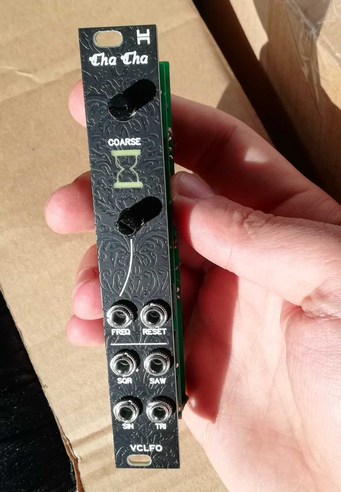
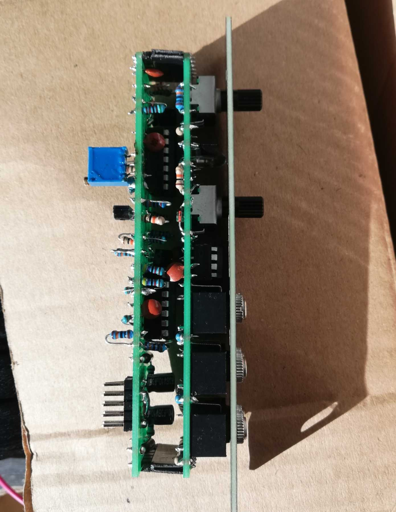
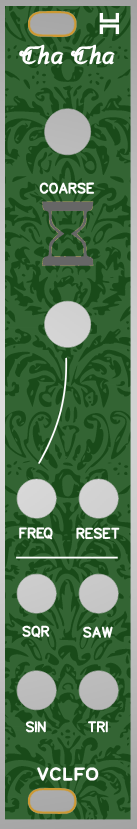
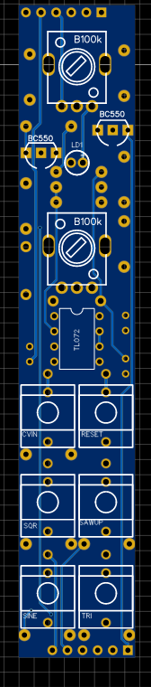
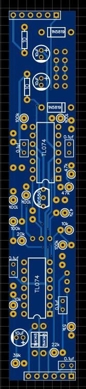

# 4HP version of Voxmachina ChaCha VCLFO Eurorack module

This project is a 4HP fork of the Voxmachina chacha VCLFO eurorack module.

## Status: Confirmed working!

## Hardware and PCB

I had it in my head to do this in 4hp, but it was quite a pain.
In the end i had to fit a lot of standing resistors which I usually dislike but i think
I spaced them in a way that wasn't too confusing.

You can simply order the pcbs as-is on any pcb manufacturing site, 
I use jlcpcb. You can order all the pcbs with the standard settings.If for some reason the dimensions for the front panel
are not entered (happens to me sometimes on jlc), put them as 128.5x20mm.

The build is relatively straight forward, apart from the standing resistors which are kind of annoying.

schematic and bom are split between the two boards, as that's how voxmachina had his project set up. So just order components from both bom files

# Tuning
I simplified the sin shaping circuit so there is only one trimmer (for the saw shaper).
As for how to tune it, check out [voxmachina's videos on the module on youtube](https://www.youtube.com/watch?v=DsVzbcYWhuM&t=31s).
